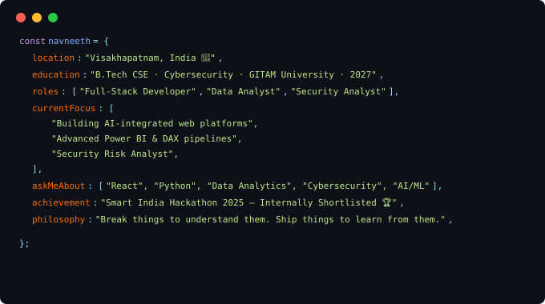

<!-- ░░░░░░░░░░░░░░░░░░░░░░░░░░░░░░  BANNER  ░░░░░░░░░░░░░░░░░░░░░░░░░░░░░░ -->

<!-- ░░░░░░░░░░░░░░░░░░░░░░░░░░░░░░  TYPING  ░░░░░░░░░░░░░░░░░░░░░░░░░░░░░░ -->

 

&nbsp;·&nbsp;

&nbsp;·&nbsp;

&nbsp;·&nbsp;

 

<!-- ░░░░░░░░░░░░░░░░░░░░░░░░░░░░░░  ABOUT  ░░░░░░░░░░░░░░░░░░░░░░░░░░░░░░ -->

  

 

<!-- ░░░░░░░░░░░░░░░░░░░░░░░░░░░  QUICK FACTS  ░░░░░░░░░░░░░░░░░░░░░░░░░░░░ -->

| 🎓 Degree | 📊 Focus | 📍 Base | 🏆 Milestone |
|:---:|:---:|:---:|:---:|
| B.Tech CSE · 2027 | Data & Business Analytics | Vizag, India | SIH 2025 Shortlisted |

 

<!-- ░░░░░░░░░░░░░░░░░░░░░░░░░░░  SKILL ICONS  ░░░░░░░░░░░░░░░░░░░░░░░░░░░░ -->

## ⚡ Analyst Toolkit

**Languages & Query**

**BI & Visualization**

**Data Wrangling & Analysis**

**Investigation & Tooling**

 

<!-- ░░░░░░░░░░░░░░░░░░░░░░░░░░░░  PROJECTS  ░░░░░░░░░░░░░░░░░░░░░░░░░░░░ -->

## 🚀 Projects

| Project | Description | Stack | Link |
|:---|:---|:---|:---:|
| 📊 **QuantVista** | Upload CSV / Excel / JSON → get interactive charts, smart analysis & exportable dashboards | `Python` `Pandas` `Power BI` | [→](https://github.com/navneethptnk/QuantVista) |
| 🎓 **EduPath** | Career guidance data platform — mapping admission timelines, scholarships & govt exam deadlines into one dataset | `MySQL` `Data Modeling` | [→](https://github.com/navneethptnk/EduPath) |
| 🔐 **Gamified Pass Checker — Data Angle** | Entropy scoring & breach-pattern analysis on password datasets, with GAN resistance probing | `Python` `Data Analysis` | [→](https://github.com/navneethptnk/gamyfied-pass-checker) |
| 🎵 **Gesture Analytics for Music** | Tracked and analyzed real-time hand & pose motion data to trigger music interactions | `Python` `MediaPipe` `OpenCV` | 🔒 private |
| 🌐 **Portfolio** | Personal site showcasing analyst case studies, dashboards & a dark minimal terminal UI | `HTML` `CSS` `JS` | [→](https://github.com/navneethptnk/navneethptnk.github.io) |

 

<!-- ░░░░░░░░░░░░░░░░░░░░░░░░░░  ACHIEVEMENTS  ░░░░░░░░░░░░░░░░░░░░░░░░░░░░ -->

## 🏅 Achievements & Highlights

| &nbsp; | What | Details |
|:---:|---|---|
| 🥇 | **Smart India Hackathon 2025** | Internally shortlisted at GITAM University — competed among top student teams on a data-driven solution |
| 📊 | **Analytics Engineer** | Built Power BI dashboards with DAX on the Olist e-commerce dataset · campus retail descriptive analytics |
| 🔍 | **Data Investigation** | Case studies in corporate espionage, steganography & mobile data forensics (WhatsApp fake news dataset analysis) |
| 🤖 | **Applied ML for Analysis** | GAN-based password pattern generation (PassGAN) · gesture-tracking data pipelines |
| 📈 | **Business Insight Delivery** | Freelance data & reporting projects delivered for external clients |
| 🧠 | **Systems & Process Mapping** | Distributed notes management system · swimlane diagrams · activity diagrams in StarUML for process analysis |

 

## 🔭 Currently

| 📚 Learning | 🔨 Building | 👀 Exploring |
|:---:|:---:|:---:|
| Advanced DAX & Power Query | Analytics dashboards & reporting tools | Business intelligence workflows |
| Statistical modeling | Data pipelines for decision-making | KPI design & data storytelling |
| SQL query optimization | Open source data projects | Market & retail analytics |

 

<!-- ░░░░░░░░░░░░░░░░░░░░░░░░░░░░  DEV QUOTE  ░░░░░░░░░░░░░░░░░░░░░░░░░░░░░ -->

 

<!-- ░░░░░░░░░░░░░░░░░░░░░░░░░░░░  FOOTER  ░░░░░░░░░░░░░░░░░░░░░░░░░░░░░░░ -->

📊 Turning data into decisions, one dashboard at a time · navneethptnk · Vizag 🌊

